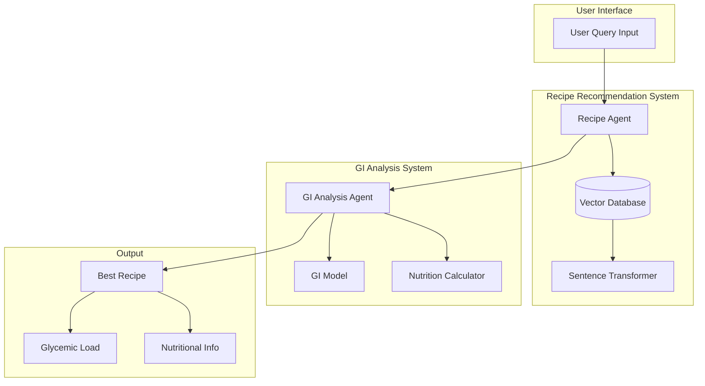
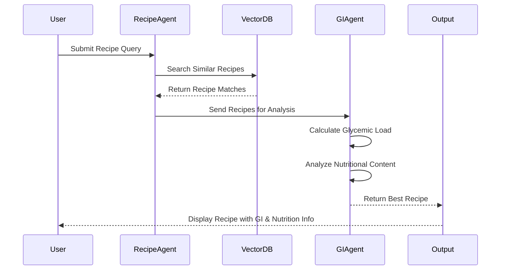

# Nutritional Assistant - System Architecture

## Multi-Agent Architecture Overview

This system implements a Multi-Agent Architecture with specialized agents working together to achieve the common goal of providing healthy recipe recommendations. The architecture follows these key principles:

1. **Specialized Agents**
   - Each agent has a specific domain expertise
   - Agents operate independently but coordinate through well-defined interfaces
   - Agents can be developed, tested, and maintained separately

2. **Agent Collaboration**
   - Agents communicate through structured data exchange
   - Each agent contributes its specialized knowledge to the final recommendation
   - The system maintains a clear separation of concerns

3. **Agent Responsibilities**
   - Recipe Agent: Handles recipe search and matching
   - GI Analysis Agent: Manages glycemic index calculations and nutritional analysis
   - Each agent can be enhanced or replaced without affecting others

## Component Diagram

## Flow Diagram

## System Components

### 1. Recipe Agent
- Handles user queries
- Searches for similar recipes
- Uses sentence transformer for semantic search
- Connects to vector database for recipe storage
- Acts as the primary coordinator agent

### 2. GI Analysis Agent
- Analyzes recipes for glycemic impact
- Calculates glycemic load
- Provides nutritional information
- Uses RoBERTa model for analysis
- Specializes in health metrics

### 3. Vector Database
- Stores recipe embeddings
- Enables semantic search
- Maintains recipe metadata
- Serves as shared knowledge base

### 4. Output Components
- Best recipe recommendation
- Glycemic load calculation
- Detailed nutritional information
- Recipe instructions and ingredients

## Data Flow

1. User submits a recipe query
2. Recipe Agent processes query using sentence transformer
3. Vector database returns similar recipes
4. GI Analysis Agent evaluates recipes for:
   - Glycemic impact
   - Nutritional content
   - Overall health score
5. System returns best recipe with:
   - Complete recipe details
   - Glycemic load calculation
   - Nutritional information
   - Preparation instructions

## Multi-Agent Benefits

1. **Modularity**
   - Each agent can be developed and maintained independently
   - Easy to add new agents or replace existing ones
   - Clear separation of concerns

2. **Scalability**
   - Agents can be scaled independently based on load
   - New capabilities can be added through new agents
   - Easy to parallelize agent operations

3. **Maintainability**
   - Issues can be isolated to specific agents
   - Updates can be made to individual agents
   - Testing can be performed at agent level

4. **Flexibility**
   - Agents can be enhanced independently
   - New agents can be added for new capabilities
   - Easy to modify agent behavior without affecting others 