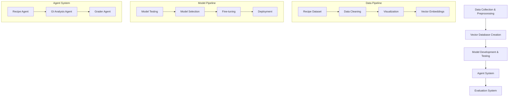
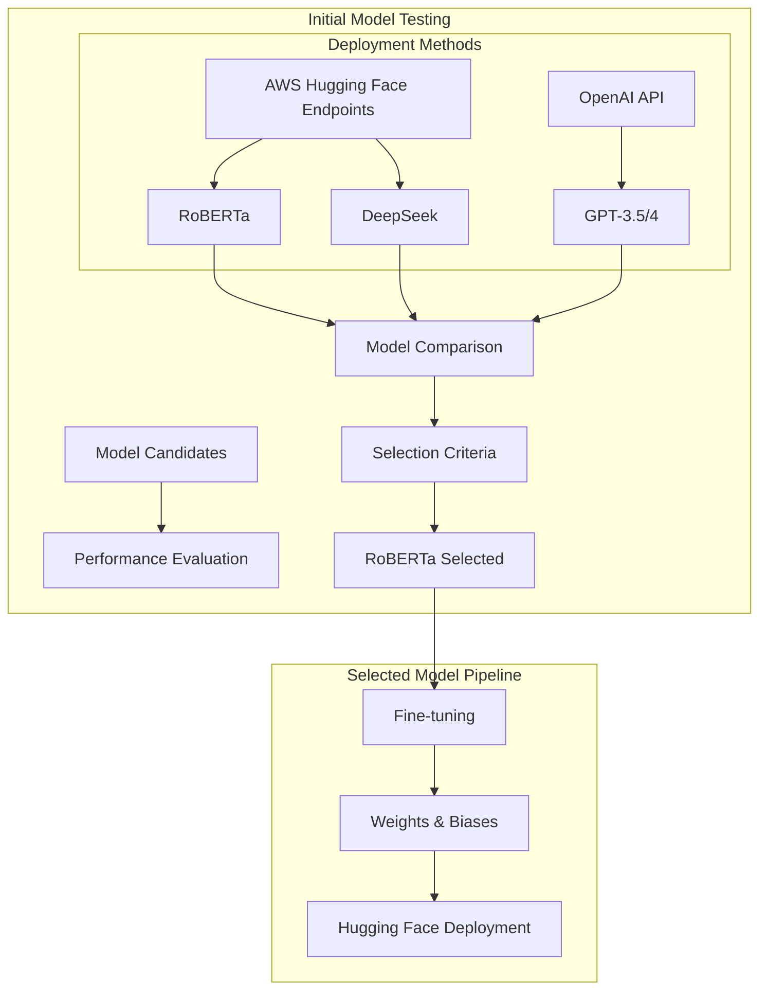
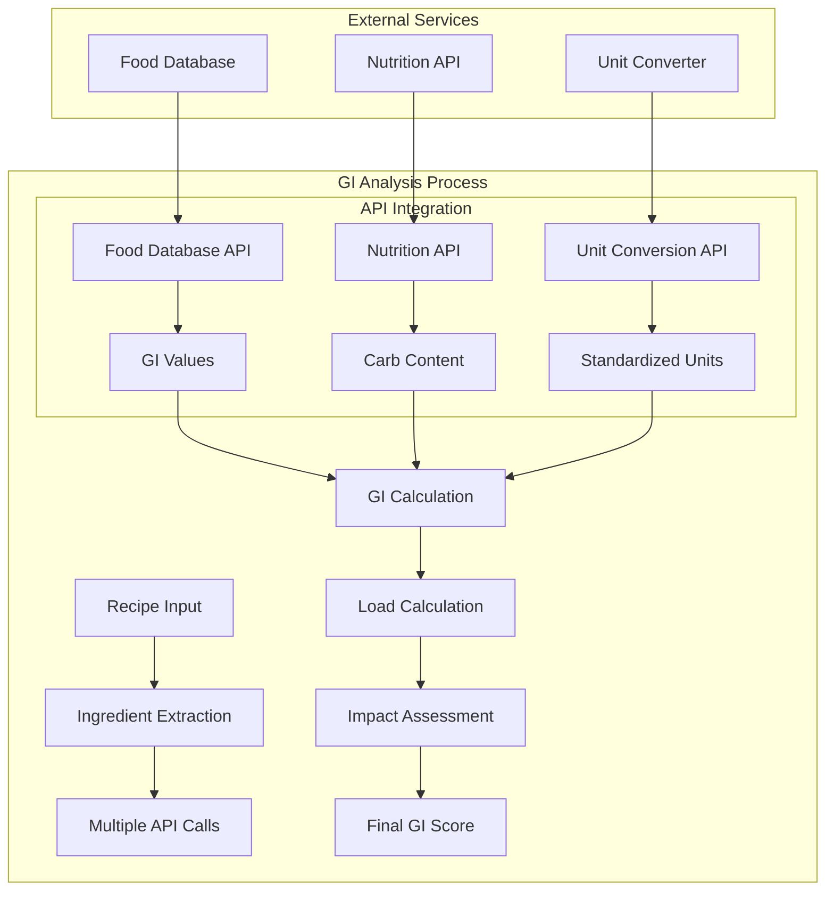
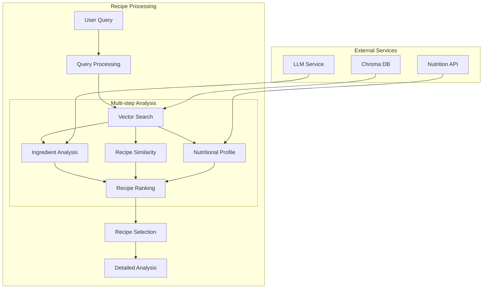
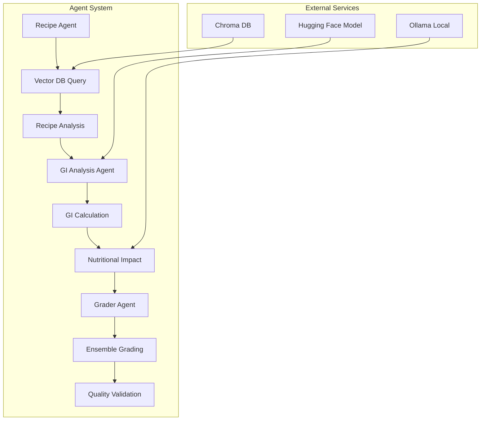

# NutriVision: Nutritional Assistant Project Documentation

## Project Overview
NutriVision is an advanced nutritional analysis system that combines multiple AI models and agents to provide comprehensive recipe analysis and nutritional guidance.

## System Architecture

### High-Level System Flow

### Model Selection & Deployment Pipeline

### GI Analysis Agent Pipeline

### Recipe Agent Pipeline

### Agent System Architecture

## Detailed Workflow

### 1. Data Preprocessing Pipeline
- **Recipe Dataset Processing**
  - Collection and cleaning of recipe data
  - Standardization of formats
  - Data validation and quality checks
  - Creation of visualizations for data analysis

- **Vector Database Creation**
  - Generation of vector embeddings using LLM
  - Creation of Chroma database for efficient storage
  - Implementation of similarity search capabilities

### 2. Model Development & Testing
- **Initial Model Testing**
  - Deployment of multiple models:
    - RoBERTa (AWS Hugging Face Inference Endpoint)
    - DeepSeek (AWS Hugging Face Inference Endpoint)
    - GPT-3.5/4 (OpenAI API)
  - Performance comparison and evaluation
  - Selection of RoBERTa as primary model based on:
    - Accuracy in GI prediction
    - Response time
    - Cost efficiency
    - API reliability

- **Model Fine-tuning**
  - GPU-based fine-tuning on Google Colab
  - Integration with Weights & Biases for:
    - Training metrics visualization
    - Resource utilization tracking
    - Model performance monitoring
    - Hyperparameter optimization
  - Deployment to Hugging Face:
    - Model versioning
    - Inference endpoint creation
    - API integration
  - Performance validation

### 3. Agent System Implementation
- **Recipe Agent**
  - Multi-step recipe processing:
    - Query understanding and processing
    - Vector similarity search
    - Ingredient analysis
    - Recipe similarity matching
    - Nutritional profile generation
    - Recipe ranking and selection
  - Integration with Chroma DB for efficient retrieval
  - LLM-powered ingredient analysis

- **GI Analysis Agent**
  - Complex pipeline for GI calculation:
    - Ingredient extraction and normalization
    - Multiple API integrations:
      - Food database for GI values
      - Nutrition API for carb content
      - Unit conversion service
    - GI and load calculations
    - Nutritional impact assessment
  - Real-time processing capabilities

- **Grader Agent System**
  - Implementation of ensemble grading
  - Integration of two Claude models
  - Quality assurance and validation

### 4. Testing & Evaluation
- **Comprehensive Testing**
  - Test categories:
    - Simple recipes
    - High GI recipes
    - Low GI recipes
  - Performance metrics collection
  - Error analysis and improvement

- **Evaluation Framework**
  - Ensemble grader agent implementation
  - Cross-validation with expert assessments
  - Performance benchmarking

## Technical Components

### Data Processing
- Vector embeddings generation
- Chroma database implementation
- Local Ollama integration for nutritional guidelines

### Model Architecture
- RoBERTa fine-tuning pipeline
  - Weights & Biases integration for monitoring
  - Training visualization and metrics tracking
  - Model checkpoint management
- Hugging Face deployment
  - Model versioning and registry
  - Inference endpoint configuration
  - API integration
- Model evaluation framework

### Agent System
- Recipe querying system
  - Multi-step processing pipeline
  - Vector similarity search
  - LLM integration
- GI analysis pipeline
  - Multiple API integrations
  - Real-time calculations
  - Unit conversion handling
- Grading mechanism

## Performance Analysis
- Model accuracy metrics
- Processing time optimization
- Resource utilization
- Weights & Biases dashboard metrics:
  - Training loss curves
  - Validation metrics
  - Resource consumption
  - Model performance comparisons

## Future Enhancements
- Additional model integrations
- Extended recipe database
- Enhanced nutritional analysis capabilities
- Advanced monitoring and visualization features