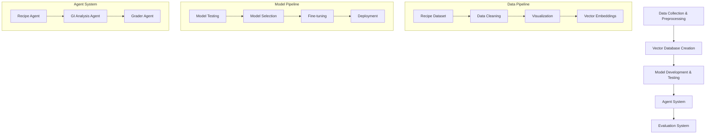

# NutriVision: Nutritional Assistant Project Documentation

## Project Overview
NutriVision is an advanced nutritional analysis system that combines multiple AI models and agents to provide comprehensive recipe analysis and nutritional guidance.

## System Architecture

## Detailed Workflow

### 1. Data Preprocessing Pipeline
- **Recipe Dataset Processing**
  - Collection and cleaning of recipe data
  - Standardization of formats
  - Data validation and quality checks
  - Creation of visualizations for data analysis

- **Vector Database Creation**
  - Generation of vector embeddings using LLM
  - Creation of Chroma database for efficient storage
  - Implementation of similarity search capabilities

### 2. Model Development & Testing
- **Initial Model Testing**
  - Deployment of multiple models on inference endpoints:
    - DeepSeek
    - ChatGPT
    - RoBERTa
  - Performance comparison and evaluation
  - Selection of RoBERTa as primary model

- **Model Fine-tuning**
  - GPU-based fine-tuning on Google Colab
  - Optimization for nutritional analysis
  - Performance validation

### 3. Agent System Implementation
- **Recipe Agent**
  - Queries vector embeddings
  - Recipe retrieval and analysis
  - Nutritional information extraction

- **GI Analysis Agent**
  - Glycemic Index calculation
  - Recipe grading based on GI values
  - Nutritional impact assessment

- **Grader Agent System**
  - Implementation of ensemble grading
  - Integration of two Claude models
  - Quality assurance and validation

### 4. Testing & Evaluation
- **Comprehensive Testing**
  - Test categories:
    - Simple recipes
    - High GI recipes
    - Low GI recipes
  - Performance metrics collection
  - Error analysis and improvement

- **Evaluation Framework**
  - Ensemble grader agent implementation
  - Cross-validation with expert assessments
  - Performance benchmarking

## Technical Components

### Data Processing
- Vector embeddings generation
- Chroma database implementation
- Local Ollama integration for nutritional guidelines

### Model Architecture
- RoBERTa fine-tuning pipeline
- Inference endpoint deployment
- Model evaluation framework

### Agent System
- Recipe querying system
- GI analysis pipeline
- Grading mechanism

## Performance Analysis
- Model accuracy metrics
- Processing time optimization
- Resource utilization

## Future Enhancements
- Additional model integrations
- Extended recipe database
- Enhanced nutritional analysis capabilities
